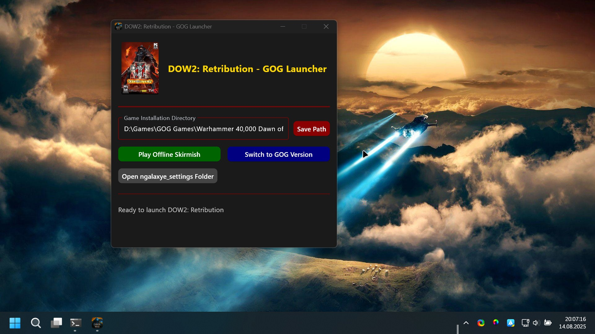

# 🎮 DOW2: Retribution - GOG Launcher

A **modern Python Flet application** for launching **Warhammer 40k: Dawn of War II – Retribution** with **GOG DLL injection** capabilities.



---

## ✨ Features

- 🎨 **Modern Warhammer 40k Theme** — Dark aesthetic with gold and red accents
- 🖼 **Game Cover Art** — Includes official DOW2: Retribution cover image
- 📏 **Fixed Window Size** — Optimized 400×300 window for consistent UI scaling
- 📂 **Game Path Management** — Save and validate your DOW2 installation directory
- 🧩 **DLL Injection** — Switch between offline skirmish and GOG version modes
- 🚀 **Auto-launch** — Automatically launches the game after DLL injection

---

## ⚙️ Installation

1. 📥 **Install Python 3.8+** if you haven't already  
2. 📦 **Install dependencies**:
   ```bash
   pip install -r requirements.txt
   ```

---

## 🕹 Usage

1. ▶ **Run the launcher**:
   ```bash
   python main.py
   ```
2. 📂 **Set Game Path**
   - Enter the directory path where `DOW2.exe` is located
   - Click **Save Path** to store the location

3. 🔄 **Choose Mode**
   - 📴 **Play Offline Skirmish** — Injects DLLs from `GOGEmuDLL/` folder and launches the game
   - 🌐 **Switch to GOG Version** — Injects DLLs from `OriginalGOGDLL/` folder

---

## 📁 File Structure

```
RETLauncher/
├── main.py                 # Main application file
├── requirements.txt        # Python dependencies
├── README.md               # This file
├── GOGEmuDLL/              # DLLs for offline skirmish mode
│   └── Galaxy.dll
└── OriginalGOGDLL/         # Original GOG DLLs
    └── Galaxy.dll
```

---

## 🧩 DLL Injection System

The launcher automatically handles **DLL injection** by copying the correct files into your game directory.

### 🔍 How It Works
1. **Smart DLL Management** — Detects and removes existing DLLs before injection  
2. **Clean Injection** — Copies fresh DLLs from the source folder  
3. **Source Preservation** — Original DLLs remain untouched for future use  
4. **Mode Switching** — Toggle between offline and GOG modes anytime

---

## 📝 Notes

- 🗂 The launcher saves your game path in `launcher_config.txt`
- ✍ DLL injection requires **write permissions** to your game folder
- 📌 Make sure the `GOGEmuDLL` and `OriginalGOGDLL` folders contain the correct DLL files
- 📏 Small application window for an **optimal minimal UI**

💡 **Extra Tip:** For further GOG game support, you can get the latest NemirtingasGalaxyEmu DLLs from:  
[🔗 Download NemirtingasGalaxyEmu builds](https://github.com/SplitScreen-Me/splitscreenme-nucleus/releases)  
Inside the `.zip` find them here:
```
NucleusApp.zip\utils\NemirtingasGalaxyEmu
```

---

## 🛠 Troubleshooting

- ❌ **"Invalid game path"** — Ensure `DOW2.exe` is in the selected folder
- ❌ **"DLL not found"** — Verify DLL files exist in their folders
- ⚠ **Permission errors** — Run the launcher as **administrator**

---

## ☕ Support Me

If you enjoy my work and want to help future development:

💰 **Ethereum (ETH)**:
```
0xfbe3E2337e7bCfC9245f0C2eAeF16597f0Bb2Dc2
```

💰 **Litecoin (LTC)**:
```
0x4338665CBB7B2485A8855A139b75D5e34AB0DB94
```
